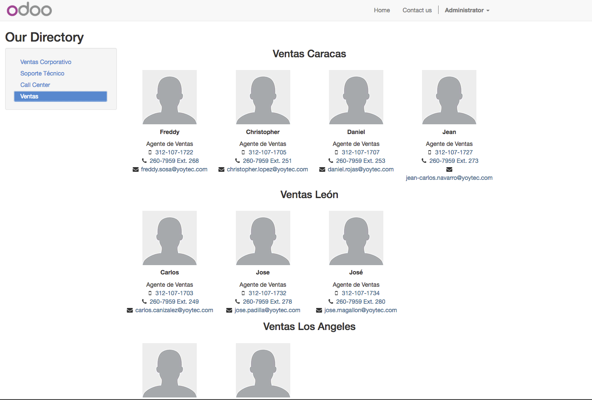
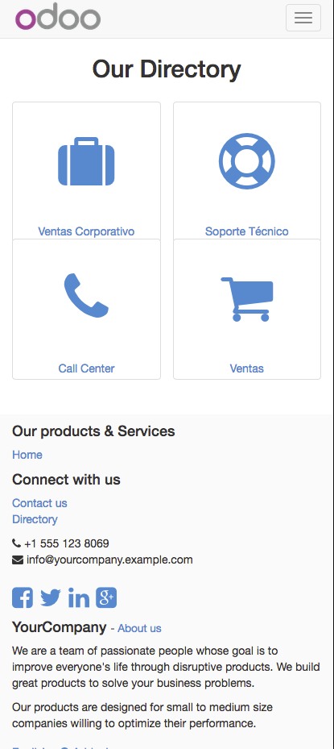
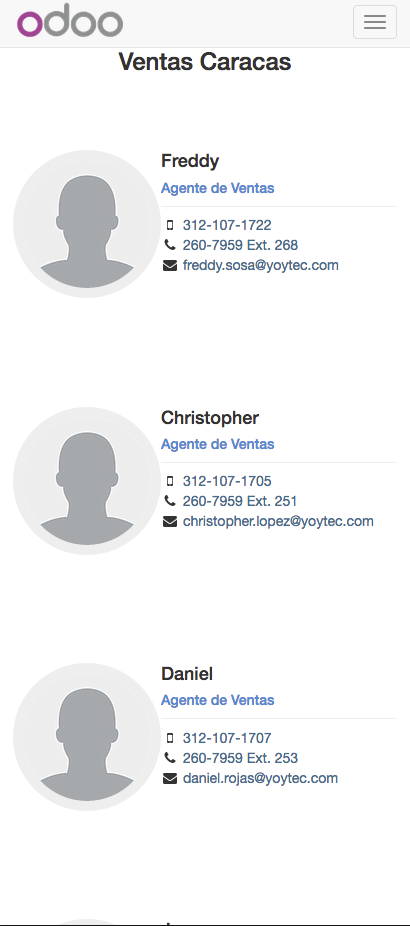

Directory Page
==============

This app adds a new page with the employee directory and its
department.

Features
--------

- It will publsh all departments that are marked as `website_published = True`.
- It will unpublish departments when there are no employees marked as
  `website_published = True` and will publish them when finds the opposite.
- If work location is set the employees will be rendered grouped by location.

Usage
-----

Just install the app and click on the footer link 'Directory'.

- To be able to see the icons on the department tiles on the mobile view
  go to `FontAwesome Site <http://fontawesome.io/icons/>`_ and click the
  desired icon for the department, you will find a name like: 'fa-icon-name'
  copy the name and paste it in the  'Icon' field on backend form of the
  department you want to assign the icon to, ie. for the suit case use: 'fa-suitcase'.

Desktop View
------------

Mobile View
-----------

Contributors
------------

* Oscar Alcala <oscar@vauxoo.com>

Maintainer
----------

.. image:: https://www.vauxoo.com/logo.png
   :alt: Vauxoo
   :target: https://vauxoo.com

This module is maintained by Vauxoo.

a latinamerican company that provides training, coaching,
development and implementation of enterprise management
sytems and bases its entire operation strategy in the use
of Open Source Software and its main product is odoo.

To contribute to this module, please visit http://www.vauxoo.com.
